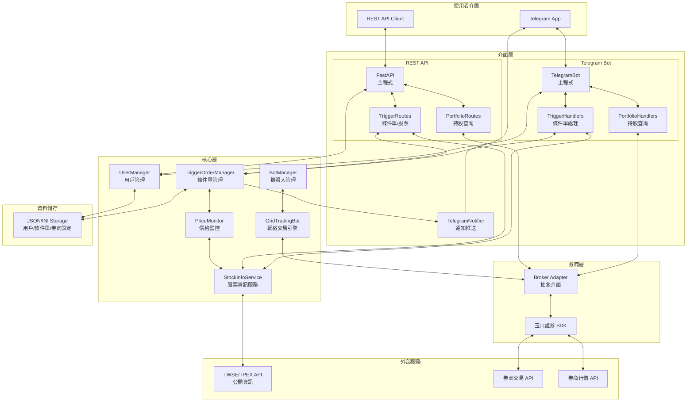
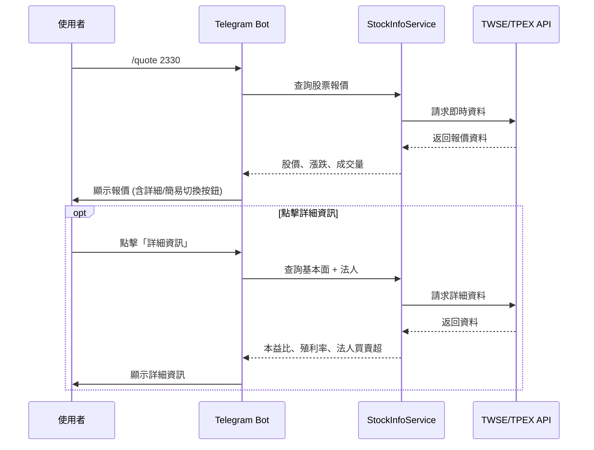
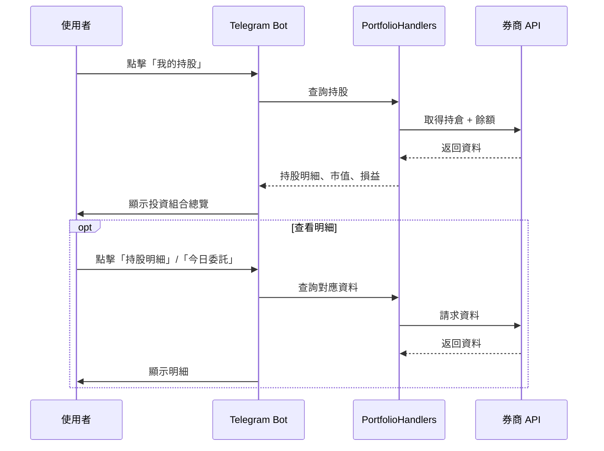
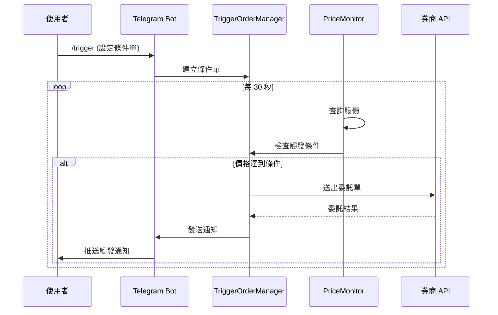
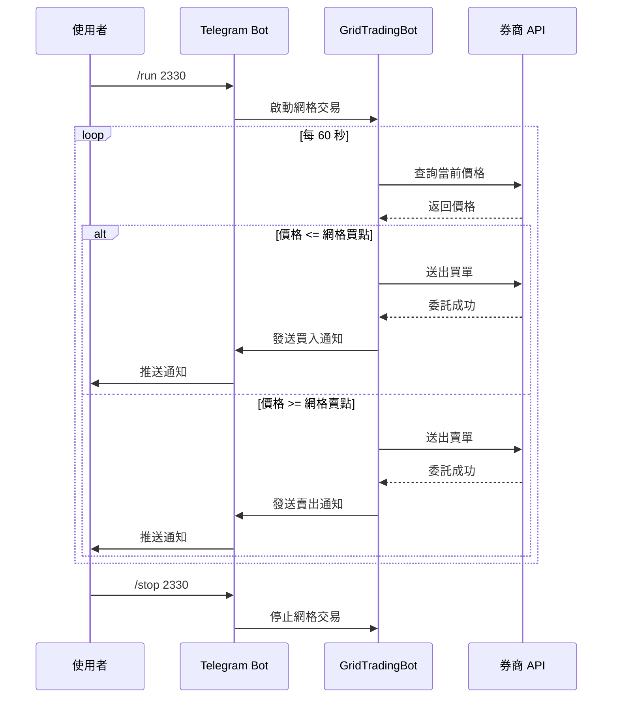

# GridPilot

台股自動化交易系統 - 支援條件單與網格交易，使用玉山證券 API，提供 Telegram Bot 與 REST API 雙介面操作。

## 功能特色

### 條件單系統
- **價格觸發自動下單** - 當股價達到設定條件時自動執行買賣
- **多種觸發條件** - 支援 `>=`（漲到）、`<=`（跌到）、`==`（等於）
- **多種交易類型** - 現股、現沖、融資、融券
- **市價/限價單** - 支援市價單與限價單
- **REST API** - 提供 API 供外部程式自動化操作
- **PIN 碼驗證** - 敏感操作需 PIN 碼確認

### 網格交易
- **自動化網格交易** - 在設定的價格區間內自動執行買賣
- **多標的支援** - 可同時運行多個股票的網格策略
- **風險控制** - 支援最大持倉、最大本金、停損停利設定

### 共用功能
- **Telegram 機器人** - 透過 Telegram 設定、控制和監控交易
- **檔案上傳設定** - 直接上傳 `.ini` 設定檔和 `.p12` 憑證
- **即時股價查詢** - 查詢即時股價資訊
- **即時通知** - 下單、成交、觸發即時推送

## 系統架構



### 架構說明

| 層級 | 元件 | 說明 |
|------|------|------|
| **使用者介面** | Telegram / REST API | 用戶透過 Telegram 或 API 操作 |
| **介面層** | TelegramBot | 處理用戶指令、互動式設定流程 |
| | TriggerHandlers | 條件單相關指令處理 |
| | PortfolioHandlers | 持股查詢相關指令處理 |
| | FastAPI | 提供 REST API 端點 |
| | TriggerRoutes | 條件單與股票查詢 API |
| | PortfolioRoutes | 持股、餘額、委託、成交查詢 API |
| | TelegramNotifier | 推送交易通知、狀態報告 |
| **核心層** | TriggerOrderManager | 條件單 CRUD 與執行管理 |
| | PriceMonitor | 每 30 秒監控股價並觸發條件單 |
| | StockInfoService | 股票即時報價、基本面、法人買賣超查詢 |
| | UserManager | 管理用戶設定、券商配置、PIN 碼、API Key |
| | BotManager | 管理多個網格機器人的生命週期 |
| | GridTradingBot | 網格交易核心邏輯 |
| **券商層** | Broker Adapter | 統一的券商介面抽象 |
| | 玉山證券 SDK | 實際的交易與行情 API 實作 |
| **外部服務** | TWSE/TPEX API | 證交所/櫃買中心公開資訊 |
| | 券商 API | 交易下單與帳戶查詢 |

### 主要流程

#### 股票報價查詢



#### 持股查詢



#### 條件單觸發



#### 網格交易



## 網格交易原理

網格交易是一種量化交易策略，在價格區間內設置多個買賣點位：

```
600 元 ← 上限
590 元 [賣出點]
580 元 [賣出點]
570 元 [賣出點]
   ...
520 元 [買入點]
510 元 [買入點]
500 元 ← 下限
```

- 價格下跌到網格點 → 自動買入
- 價格上漲到網格點 → 自動賣出
- 持續循環，賺取價差

## 安裝

### 環境需求

- Python 3.10+
- 玉山證券 API 權限

### 安裝步驟

```bash
# Clone 專案
git clone https://github.com/a21780816/GridPilot.git
cd GridPilot

# 使用 uv 建立虛擬環境並安裝依賴
uv sync

# 安裝玉山證券 SDK（需自行向玉山證券取得）
uv pip install esun_trade-*.whl
uv pip install esun_marketdata-*.whl
```

> SDK 檔案需自行向玉山證券申請 API 權限後取得，不包含在此專案中。

## 快速開始

### 1. 建立 Telegram Bot

1. 在 Telegram 搜尋 [@BotFather](https://t.me/BotFather)
2. 發送 `/newbot` 建立新的 Bot
3. 記下取得的 Bot Token

### 2. 設定 Telegram Bot Token

```bash
# 複製設定檔範例
cp config/telegram.example.ini config/telegram.ini

# 編輯設定檔，填入你的 Bot Token
```

### 3. 啟動 Telegram Bot

```bash
uv run python scripts/run_telegram_bot.py
```

### 4. 透過 Telegram 設定

在 Telegram 中與你的 Bot 對話：

1. `/start` - 開始使用，進入主選單
2. 選擇「券商設定」或 `/broker` - 設定券商 API
   - 選擇券商後，上傳 `.ini` 設定檔
   - 再上傳 `.p12` 憑證檔
3. `/setpin` - 設定 PIN 碼（條件單必要）
4. `/trigger` - 新增條件單
   - 輸入股票代號後會自動顯示即時股價
   - 選擇觸發條件、交易類型、訂單類型
   - 輸入 PIN 碼確認

所有設定都會自動儲存在 `users/{chat_id}/` 目錄下。

### 5. 啟動 REST API（可選）

如需透過 API 操作條件單：

```bash
uv run python scripts/run_api.py
```

API 預設運行在 `http://localhost:8000`，API 文件位於 `/docs`。

### 券商設定檔格式

```ini
[Esun]
PersonId = A123456789
Account = 1234567
CertPath = cert.p12
CertPassword = your_password
Env = simulation
BrokerId = 6460
```

> 設定檔中的 `CertPath` 會在上傳憑證後自動更新為正確路徑。

## Telegram 指令

### 基本指令

| 指令 | 說明 |
|------|------|
| `/start` | 開始使用，顯示主選單 |
| `/menu` | 顯示主選單 |
| `/help` | 顯示說明 |
| `/cancel` | 取消目前操作 |
| `/quote [代號]` | 查詢即時股價（支援詳細/簡易模式切換） |

### 券商管理

| 指令 | 說明 |
|------|------|
| `/broker` | 管理券商設定（新增/重新設定） |
| `/brokers` | 查看已設定的券商 |

### 持股查詢

| 指令 | 說明 |
|------|------|
| `/holdings` | 查詢持股明細 |
| `/balance` | 查詢帳戶餘額 |
| `/orders` | 查詢今日委託 |
| `/trades` | 查詢今日成交 |

> 也可透過主選單「我的持股」按鈕進入投資組合總覽

### 條件單

| 指令 | 說明 |
|------|------|
| `/trigger` | 新增條件單（互動式引導） |
| `/triggers` | 查看所有條件單 |
| `/deltrigger [ID]` | 刪除條件單（需 PIN 碼） |
| `/setpin` | 設定/更新 PIN 碼 |
| `/apikey` | 查看/重新產生 API Key |

### 網格交易

| 指令 | 說明 |
|------|------|
| `/grid` | 新增網格策略 |
| `/grids` | 查看所有網格策略 |
| `/edit [代號]` | 修改網格設定 |
| `/delete [代號]` | 刪除網格設定 |
| `/run [代號]` | 啟動指定標的 |
| `/stop [代號]` | 停止指定標的 |
| `/runall` | 啟動所有網格 |
| `/stopall` | 停止所有網格 |
| `/status [代號]` | 查看運行狀態 |

## REST API

條件單系統提供 REST API 供外部程式操作。

### 認證方式

在 HTTP Header 中加入 API Key：

```
X-API-Key: sk-your-api-key-here
```

API Key 可透過 Telegram Bot 的 `/apikey` 指令取得。

### API 端點

#### 條件單

| Method | Endpoint | 說明 |
|--------|----------|------|
| `POST` | `/api/v1/triggers` | 建立條件單 |
| `GET` | `/api/v1/triggers` | 列出條件單 |
| `GET` | `/api/v1/triggers/{id}` | 取得條件單詳情 |
| `PUT` | `/api/v1/triggers/{id}` | 更新條件單 |
| `DELETE` | `/api/v1/triggers/{id}` | 刪除條件單 |

#### 股票資訊

| Method | Endpoint | 說明 |
|--------|----------|------|
| `GET` | `/api/v1/stocks/{symbol}/quote` | 查詢即時股價 |
| `GET` | `/api/v1/stocks/{symbol}/detail` | 查詢詳細資訊（含基本面、法人） |
| `GET` | `/api/v1/stocks/{symbol}/fundamental` | 查詢基本面資訊 |
| `GET` | `/api/v1/stocks/{symbol}/institutional` | 查詢法人買賣超 |

#### 持股查詢

| Method | Endpoint | 說明 |
|--------|----------|------|
| `GET` | `/api/v1/portfolio/summary` | 投資組合摘要 |
| `GET` | `/api/v1/portfolio/positions` | 持倉列表 |
| `GET` | `/api/v1/portfolio/positions/{symbol}` | 單一持倉詳情 |
| `GET` | `/api/v1/portfolio/balance` | 帳戶餘額 |
| `GET` | `/api/v1/portfolio/orders` | 今日委託 |
| `GET` | `/api/v1/portfolio/transactions` | 成交紀錄 |
| `GET` | `/api/v1/portfolio/settlements` | 交割資訊 |

### 建立條件單範例

```bash
curl -X POST http://localhost:8000/api/v1/triggers \
  -H "Content-Type: application/json" \
  -H "X-API-Key: sk-your-api-key" \
  -d '{
    "symbol": "2330",
    "condition": ">=",
    "trigger_price": 1000,
    "order_action": "buy",
    "order_type": "market",
    "trade_type": "cash",
    "quantity": 1
  }'
```

### 交易類型說明

| 值 | 說明 |
|-----|------|
| `cash` | 現股 |
| `day_trade` | 現沖（當沖） |
| `margin_buy` | 融資買進 |
| `short_sell` | 融券賣出 |

## 專案結構

```
GridPilot/
├── config/                       # 配置文件
│   ├── telegram.example.ini      # Telegram Bot 設定範例
│   └── config.example.ini        # 券商 API 設定範例
├── src/
│   ├── api/                      # REST API (FastAPI)
│   │   ├── main.py               # API 入口
│   │   ├── dependencies.py       # 依賴注入
│   │   ├── middleware/           # 中介層
│   │   │   └── auth.py           # API Key 認證
│   │   ├── models/               # Pydantic 模型
│   │   │   ├── requests.py       # 請求模型
│   │   │   └── responses.py      # 響應模型
│   │   └── routes/               # 路由
│   │       ├── health.py         # 健康檢查
│   │       ├── trigger_orders.py # 條件單 + 股票查詢 API
│   │       ├── portfolio.py      # 持股查詢 API
│   │       └── users.py          # 用戶 API
│   ├── brokers/                  # 券商介面
│   │   ├── base.py               # 抽象基底類別
│   │   └── esun.py               # 玉山證券實作
│   ├── core/                     # 核心邏輯
│   │   ├── trigger_order_manager.py  # 條件單管理器
│   │   ├── price_monitor.py      # 價格監控服務
│   │   ├── stock_info.py         # 股票資訊服務（報價/基本面/法人）
│   │   ├── grid_trading_bot.py   # 網格交易機器人
│   │   ├── bot_manager.py        # 機器人管理器
│   │   └── user_manager.py       # 用戶管理
│   ├── models/                   # 資料模型
│   │   ├── enums.py              # 列舉定義
│   │   ├── trigger_order.py      # 條件單模型
│   │   └── order_log.py          # 執行紀錄模型
│   ├── storage/                  # 儲存層
│   │   ├── base.py               # 抽象基類
│   │   └── json_storage.py       # JSON 檔案儲存
│   └── telegram/                 # Telegram 整合
│       ├── telegram_bot.py       # Telegram Bot 主程式
│       ├── telegram_notifier.py  # 通知模組
│       └── handlers/             # 指令處理器
│           ├── trigger_handlers.py   # 條件單指令
│           └── portfolio_handlers.py # 持股查詢指令
├── scripts/                      # 執行腳本
│   ├── run_telegram_bot.py       # 啟動 Telegram Bot
│   ├── run_api.py                # 啟動 REST API
│   └── get_telegram_chat_id.py   # 取得 Chat ID
├── users/                        # 用戶資料（自動生成）
│   └── {chat_id}/                # 各用戶獨立目錄
│       ├── config.json           # 用戶基本設定（含 PIN、API Key）
│       ├── brokers/              # 券商設定 (.ini)
│       ├── credentials/          # 憑證檔案 (.p12)
│       ├── grids/                # 網格策略設定
│       └── triggers/             # 條件單資料 (.json)
├── tests/                        # 測試程式
└── docs/                         # 文件
```

## 條件單使用情境

### 突破買入

當股價突破壓力位時自動買入：

```
股票: 2330 台積電
條件: 價格 >= 1050
動作: 現股 市價買 1張
```

### 跌破停損

當股價跌破支撐位時自動賣出：

```
股票: 2330 台積電
條件: 價格 <= 950
動作: 現股 市價賣 1張
```

### 現沖交易

配合日內沖銷策略：

```
股票: 2330 台積電
條件: 價格 >= 1020
動作: 現沖 市價買 1張
```

## 風險提醒

### 條件單風險

- ⚠️ **價格監控延遲** - 系統每 30 秒查詢一次股價，可能錯過極短期價格變動
- ⚠️ **下單不保證成交** - 市價單或限價單可能因流動性不足而無法成交
- ⚠️ **觸發時機** - 價格達到條件時立即觸發，無法預測後續走勢

### 網格交易適用場景

- ✅ 震盪盤整行情
- ✅ 價格波動規律的標的
- ❌ 單邊上漲趨勢（會過早賣出）
- ❌ 單邊下跌趨勢（會持續買入虧損）

### 注意事項

1. **先使用模擬環境測試** - 確認策略運作正常後再使用正式環境
2. **設定合理的觸發價格** - 根據標的的技術分析設定
3. **控制資金投入** - 建議單一標的不超過總資金 20%
4. **定期檢查** - 監控交易狀況，適時調整策略
5. **保管好 API Key** - 切勿分享給他人

## 策略範例

### 保守型策略（大型 ETF）

| 參數 | 值 | 說明 |
|------|-----|------|
| 股票代號 | 0050 | 元大台灣50 |
| 價格下限 | 130 | |
| 價格上限 | 150 | |
| 網格數量 | 10 | |
| 每格張數 | 1 | |

### 積極型策略（個股）

| 參數 | 值 | 說明 |
|------|-----|------|
| 股票代號 | 2330 | 台積電 |
| 價格下限 | 900 | |
| 價格上限 | 1100 | |
| 網格數量 | 20 | 較密集的網格 |
| 每格張數 | 1 | |

## 開發

```bash
# 執行測試
python -m pytest tests/

# 測試 Telegram 連線
python tests/test_telegram.py
```

## 免責聲明

本程式僅供學習和研究使用。使用本程式進行實際交易的所有風險由使用者自行承擔。

- 網格交易存在風險，可能導致資金損失
- 請先在模擬環境充分測試
- 建議諮詢專業投資顧問
- 作者不對任何交易損失負責

## 授權

MIT License
