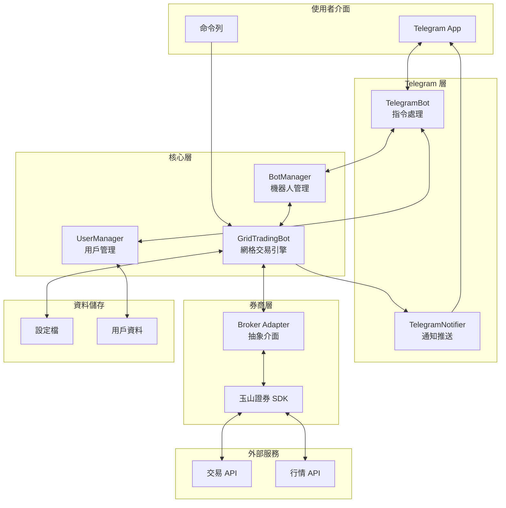
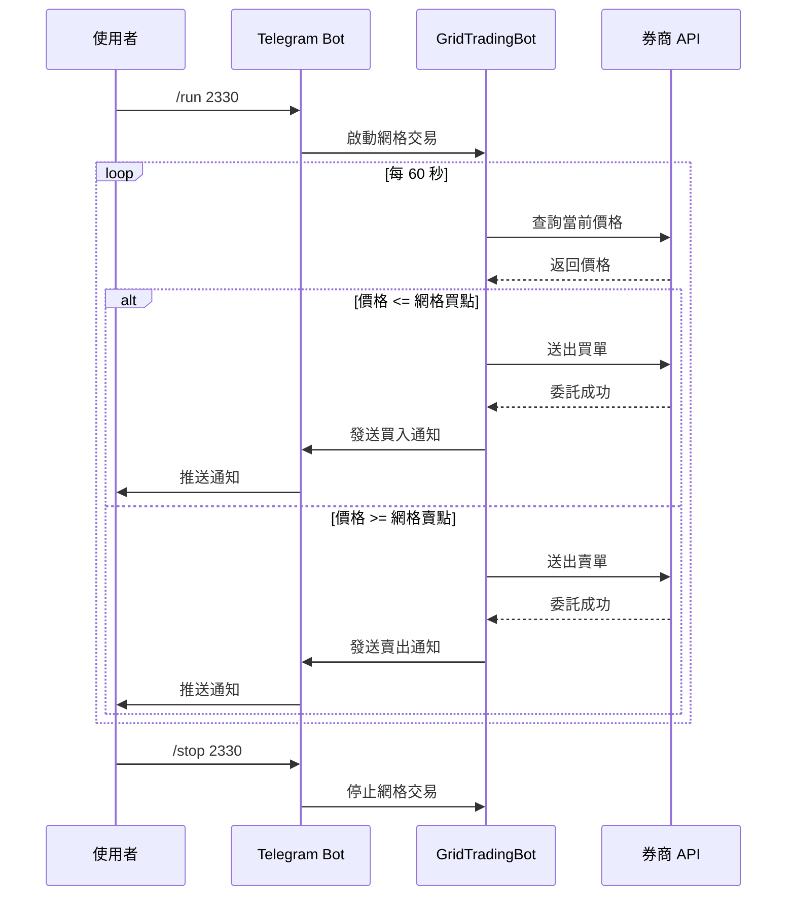

# GridPilot

台股網格交易機器人 - 使用玉山證券 API 實現的自動化網格交易系統，支援 Telegram 機器人互動操作。

## 功能特色

- **自動化網格交易** - 在設定的價格區間內自動執行買賣
- **Telegram 機器人** - 透過 Telegram 設定、控制和監控交易
- **多標的支援** - 可同時運行多個股票的網格策略
- **即時通知** - 下單、成交、停損停利即時推送
- **風險控制** - 支援最大持倉、最大本金、停損停利設定

## 系統架構



### 架構說明

| 層級 | 元件 | 說明 |
|------|------|------|
| **使用者介面** | Telegram / CLI | 用戶透過 Telegram 或命令列操作 |
| **Telegram 層** | TelegramBot | 處理用戶指令、互動式設定流程 |
| | TelegramNotifier | 推送交易通知、狀態報告 |
| **核心層** | BotManager | 管理多個網格機器人的生命週期 |
| | UserManager | 管理用戶設定、券商配置、網格策略 |
| | GridTradingBot | 網格交易核心邏輯、價格監控、下單執行 |
| **券商層** | Broker Adapter | 統一的券商介面抽象 |
| | 玉山證券 SDK | 實際的交易與行情 API 實作 |

### 交易流程



## 網格交易原理

網格交易是一種量化交易策略，在價格區間內設置多個買賣點位：

```
600 元 ← 上限
590 元 [賣出點]
580 元 [賣出點]
570 元 [賣出點]
   ...
520 元 [買入點]
510 元 [買入點]
500 元 ← 下限
```

- 價格下跌到網格點 → 自動買入
- 價格上漲到網格點 → 自動賣出
- 持續循環，賺取價差

## 安裝

### 環境需求

- Python 3.10+
- 玉山證券 API 權限

### 安裝步驟

```bash
# Clone 專案
git clone https://github.com/a21780816/GridPilot.git
cd GridPilot

# 使用 uv 安裝依賴
uv sync

# 或使用 pip
pip install -r requirements.txt
```

### 安裝玉山證券 SDK

```bash
# 安裝交易 SDK (根據您的系統選擇對應版本)
pip install config/esun_trade-2.0.0-cp37-abi3-macosx_11_0_arm64.whl

# 安裝市場數據 SDK
pip install config/esun_marketdata-2.0.0-cp37-abi3-macosx_11_0_arm64.whl
```

## 快速開始

### 1. 設定券商 API

複製範例設定檔並填入您的 API 資訊：

```bash
cp config/config.example.ini config/config.ini
```

編輯 `config/config.ini`：

```ini
[esun]
entry_point = https://api.esunbank.com.tw
cert_path = ./config/your_cert.p12
cert_password = your_password
api_key = your_api_key
api_secret = your_api_secret
account = your_account
```

### 2. 設定網格參數

複製並編輯網格設定檔：

```bash
cp config/grid_config_example.py config/grid_config.py
```

```python
# 交易參數
STOCK_SYMBOL = "2330"    # 股票代號
LOWER_PRICE = 900.0      # 網格下限
UPPER_PRICE = 1000.0     # 網格上限
GRID_NUM = 10            # 網格數量
QUANTITY_PER_GRID = 1    # 每格交易量（張）
CHECK_INTERVAL = 60      # 檢查間隔（秒）

# Telegram 設定（可選）
TELEGRAM_BOT_TOKEN = "your_bot_token"
TELEGRAM_CHAT_ID = "your_chat_id"
```

### 3. 啟動網格機器人

```bash
python scripts/run_grid_bot.py
```

## 使用 Telegram 機器人

### 設定 Telegram Bot

1. 在 Telegram 搜尋 @BotFather 建立新的 Bot
2. 取得 Bot Token
3. 執行腳本取得您的 Chat ID：

```bash
python scripts/get_telegram_chat_id.py
```

### 啟動 Telegram Bot

```bash
python scripts/run_telegram_bot.py
```

### Telegram 指令

| 指令 | 說明 |
|------|------|
| `/start` | 開始使用 |
| `/help` | 顯示說明 |
| `/broker` | 新增券商設定 |
| `/brokers` | 查看已設定的券商 |
| `/grid` | 新增網格策略 |
| `/grids` | 查看所有網格策略 |
| `/run [代號]` | 啟動指定標的 |
| `/stop [代號]` | 停止指定標的 |
| `/runall` | 啟動所有網格 |
| `/stopall` | 停止所有網格 |
| `/status` | 查看運行狀態 |

## 專案結構

```
GridPilot/
├── config/                    # 配置文件
│   ├── config.example.ini     # 券商 API 設定範例
│   └── grid_config_example.py # 網格參數設定範例
├── src/
│   ├── brokers/              # 券商介面
│   │   ├── base.py           # 抽象基底類別
│   │   └── esun.py           # 玉山證券實作
│   ├── core/                 # 核心邏輯
│   │   ├── grid_trading_bot.py   # 網格交易機器人
│   │   ├── bot_manager.py        # 機器人管理器
│   │   ├── user_manager.py       # 用戶管理
│   │   └── calculate_capital.py  # 本金計算器
│   └── telegram/             # Telegram 整合
│       ├── telegram_bot.py       # Telegram Bot 主程式
│       └── telegram_notifier.py  # 通知模組
├── scripts/                  # 執行腳本
│   ├── run_grid_bot.py       # 啟動網格機器人
│   ├── run_telegram_bot.py   # 啟動 Telegram Bot
│   └── get_telegram_chat_id.py   # 取得 Chat ID
├── tests/                    # 測試程式
└── docs/                     # 文件
```

## 風險提醒

### 適用場景

- ✅ 震盪盤整行情
- ✅ 價格波動規律的標的
- ❌ 單邊上漲趨勢（會過早賣出）
- ❌ 單邊下跌趨勢（會持續買入虧損）

### 注意事項

1. **先使用模擬環境測試** - 確認策略運作正常後再使用正式環境
2. **設定合理的價格區間** - 根據標的的歷史波動設定
3. **控制資金投入** - 建議單一標的不超過總資金 20%
4. **定期檢查** - 監控交易狀況，適時調整策略

## 策略範例

### 保守型策略

```python
STOCK_SYMBOL = "0050"   # 元大台灣50
LOWER_PRICE = 130.0
UPPER_PRICE = 150.0
GRID_NUM = 10
QUANTITY_PER_GRID = 1
```

### 積極型策略

```python
STOCK_SYMBOL = "2330"   # 台積電
LOWER_PRICE = 900.0
UPPER_PRICE = 1100.0
GRID_NUM = 20
QUANTITY_PER_GRID = 1
```

## 開發

```bash
# 執行測試
python -m pytest tests/

# 測試 Telegram 連線
python tests/test_telegram.py
```

## 免責聲明

本程式僅供學習和研究使用。使用本程式進行實際交易的所有風險由使用者自行承擔。

- 網格交易存在風險，可能導致資金損失
- 請先在模擬環境充分測試
- 建議諮詢專業投資顧問
- 作者不對任何交易損失負責

## 授權

MIT License
